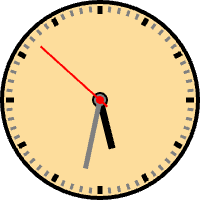
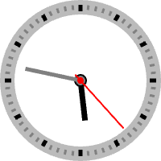

# React Clock

An analog clock for your [_React_](https://reactjs.org) application.

## Installation

```sh
> npm install @nealrame/react-clock
```

## Usage

```jsx
import * as React from "react"

import Clock from "@neal-rame/react-clock"

const app = () => {
    const [date, setDate] = React.useState(new Date())

    React.useEffect(() => {
        const interval = setInterval(() => {
            setDate(new Date())
        }, 1000)
        return () => clearInterval(interval)
    })

    return <Clock date={ date } />
}
```

## Customization

### size
Use this property to change the size of the clock.

#### example
```jsx
const app = () => {
    return <Clock date={ new Date() } size={ 200 } />
}
```

### backgroundColor
Use this property to change the background color of the clock. Accept a string
parsed as CSS <[color](https://developer.mozilla.org/en-US/docs/Web/CSS/color_value)> value.

#### example
```jsx
const app = () => {
    return <Clock
        date={ new Date() }
        backgroundColor={ "#fddd9c" }
    />
}
```

<p align="center"></p>

### borderColor
Use this property to change the border color of the clock. Accept a string
parsed as CSS <[color](https://developer.mozilla.org/en-US/docs/Web/CSS/color_value)> value.

#### example
```jsx
const app = () => {
    return <Clock
        date={ new Date() }
        borderColor={ "#a56ef9" }
    />
}
```

<p align="center"></p>

### borderThickness
Use this property to change the border thickness of the clock. Accept a number.

#### example
```jsx
const app = () => {
    return <Clock
        date={ date }
        borderColor={ "#bbb" }
        borderThickness={ 18 }
    />
}
```

<p align="center"></p>

### padding

### hourHandColor

### hourHandRadius

### hourHandSize

### hourHandTailSize

### hourHandThickness

### hourMarkerColor

### hourMarkerSize

### hourMarkerThickness

### minuteHandColor

### minuteHandRadius

### minuteHandSize

### minuteHandTailSize

### minuteHandThickness

### minuteMarkerColor

### minuteMarkerSize

### minuteMarkerThickness

### secondHandColor

### secondHandRadius

### secondHandSize

### secondHandTailSize

### secondHandThickness
