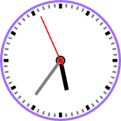

# React Clock

An analog clock for your [_React_](https://reactjs.org) application.

## Installation

```sh
> npm install @nealrame/react-clock
```

## Usage

```jsx
import * as React from "react"

import Clock from "@neal-rame/react-clock"

const app = () => {
    const [date, setDate] = React.useState(new Date())

    React.useEffect(() => {
        const interval = setInterval(() => {
            setDate(new Date())
        }, 1000)
        return () => clearInterval(interval)
    })

    return <Clock date={ date } />
}
```

## Customization

### size
Use this property to change the size of the clock.

#### example
```jsx
const app = () => {
    return <Clock date={ new Date() } size={ 200 } />
}
```

### backgroundColor
Use this property to change the background color of the clock. Accept a string
parsed as CSS <[color](https://developer.mozilla.org/en-US/docs/Web/CSS/color_value)> value.

#### example
```jsx
const app = () => {
    return <Clock
        date={ new Date() }
        backgroundColor={ "#fddd9c" }
    />
}
```

<p align="center"></p>

### borderColor
Use this property to change the border color of the clock. Accept a string
parsed as CSS <[color](https://developer.mozilla.org/en-US/docs/Web/CSS/color_value)> value.

#### example
```jsx
const app = () => {
    return <Clock
        date={ new Date() }
        borderColor={ "#a56ef9" }
    />
}
```

<p align="center"></p>

### borderThickness
Use this property to change the border thickness of the clock. Accept a number.

#### example
```jsx
const app = () => {
    return <Clock
        date={ date }
        borderColor={ "#bbb" }
        borderThickness={ 18 }
    />
}
```

<p align="center"></p>

### padding
Use this property to change the padding between border and marks of the clock.
Accept a number.

#### example
```jsx
const app = () => {
    return <Clock
        date={ date }
        padding={ 16 }
    />
}
```

<p align="center"></p>

### hourHandColor
### minuteHandColor
### secondHandColor
Use this properties to change the color of respectively hour, minute and
second hand. Accept a string parsed as CSS <[color](https://developer.mozilla.org/en-US/docs/Web/CSS/color_value)> value.

#### example
```jsx
const app = () => {
    return <Clock
        date={ date }
        hourHandColor={ "#02b701" }
        minuteHandColor={ "#a56ef9" }
        secondHandColor={ "#37a1ff" }
    />
}
```

<p align="center"></p>

### hourHandRadius
### minuteHandRadius
### secondHandRadius
Use this properties to change the radius of respectively hour, minute and
second hand. Accept number.

#### example
```jsx
const app = () => {
    return <Clock
        date={ date }
        hourHandRadius={ 16 }
        minuteHandRadius={ 16 }
        secondHandRadius={ 16 }
    />
}
```

<p align="center"></p>

### hourHandSize
### minuteHandSize
### secondHandSize
Use this property to change the size of the hour hand. Accept a number.

#### example
```jsx
const app = () => {
    return <Clock
        date={ date }
        hourHandSize={ 40 }
        minuteHandSize={ 64 }
        secondHandSize={ 72 }
    />
}
```

<p align="center"></p>

### hourHandTailSize
### minuteHandTailSize
### secondHandTailSize
Use this property to change the size of the tail of respectively hour, minute
and hand. Accept a number.

#### example
```jsx
const app = () => {
    return <Clock
        date={ date }
        hourHandTailSize={ 16 }
        minuteHandTailSize={ 16 }
        secondHandTailSize={ 16 }
    />
}
```

<p align="center"></p>

### hourHandThickness
### minuteHandThickness
### secondHandThickness
Use this property to change the thickness of respectively hour, minute and
second hand. Accept a number.

#### example
```jsx
const app = () => {
    return <Clock
        date={ date }
        hourHandThickness={ 14 }
        minuteHandThickness={ 10 }
        secondHandThickness={ 2 }
    />
}
```

<p align="center"></p>

### hourMarkerColor
### minuteMarkerColor
Use this property to change the color of respectively hour, minute markers.
Accept a string parsed as CSS <[color](https://developer.mozilla.org/en-US/docs/Web/CSS/color_value)> value.

#### example
```jsx
const app = () => {
    return <Clock
        date={ date }
        hourMarkerColor={ "#a56ef9" }
        minuteMarkerColor={ "#01aaba" }
    />
}
```

<p align="center"></p>

### hourMarkerSize
### minuteMarkerSize

### hourMarkerThickness
### minuteMarkerThickness

